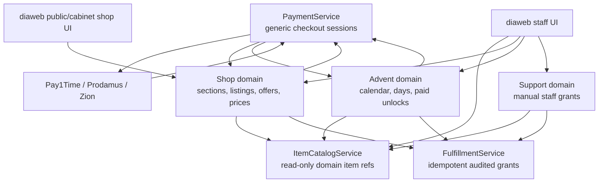
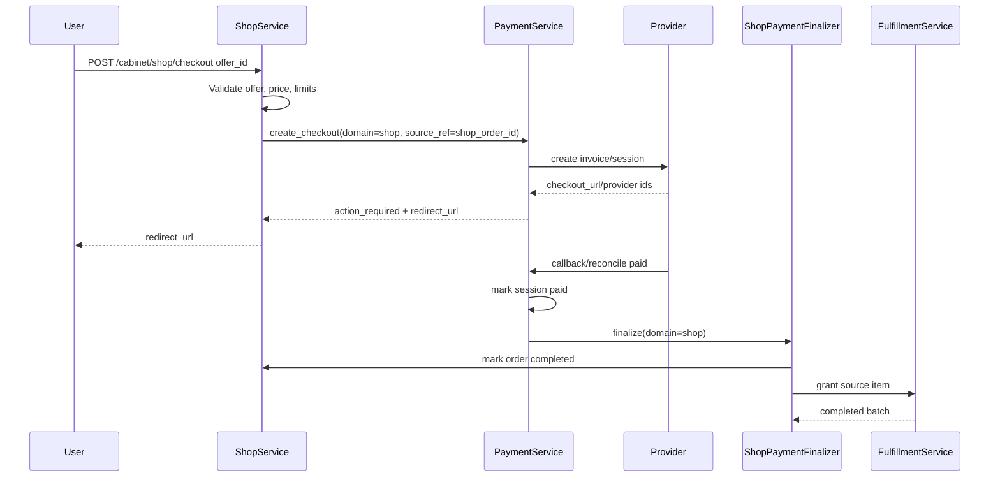

# Implementation Plan: Cabinet Commerce Core

Branch: feature/architect-cab
Created: 2026-04-24

## Settings
- Testing: yes
- Logging: verbose
- Docs: yes
- Preference assumptions: full senior/lead implementation plan, with automated backend/frontend coverage and mandatory docs checkpoint before completion.
- Frontend copy: Russian-only for this implementation; do not add a dictionary/i18n task unless requested later.

## Workspace Mode
- Mode: multi-repo full
- Workspace root: C:\Users\Indigo\Desktop\diaverse
- Shared graph: C:\Users\Indigo\Desktop\diaverse\graphify-out\graph.json
- Affected repositories: `diaverseapi`, `diaweb`
- Unaffected repositories: `aibot`

## Repository Matrix
| Repository | Path | Affected | Branch | Git status | Role |
| --- | --- | --- | --- | --- | --- |
| diaweb | C:\Users\Indigo\Desktop\diaverse\diaweb | yes | feature/architect-cab | clean | Next.js frontend, staff UI, shop purchase UI |
| diaverseapi | C:\Users\Indigo\Desktop\diaverse\diaverseapi | yes | feature/architect-cab | clean | FastAPI backend, SQLModel, payments, fulfillment, admin APIs |
| aibot | C:\Users\Indigo\Desktop\diaverse\aibot | no | dev | clean | copywriting service; no runtime changes planned |

## Research Context
Source: current `$aif-explore` discussion plus source verification.

Goal:
- Build a scalable cabinet commerce architecture where shop, advent calendars, support, and future modules can select catalog items, accept payments when needed, and grant rewards through one audited/idempotent fulfillment core.
- Convert payments from "looks reusable but advent-specific" into a reusable payment session/provider/finalizer layer.
- Add staff/admin control for shop sections, item listings, offers, and prices without letting bootstrap sync overwrite admin decisions.

Current facts verified in source:
- `diaverseapi/app/cabinet/payments/types.py` already defines `CabinetPaymentDomainCode = "advent" | "shop"`.
- `diaverseapi/app/cabinet/payments/registry.py` defaults provider `domain_codes` to `("advent",)`, so current provider capability registration is advent-only unless overridden.
- `diaverseapi/app/cabinet/payments/service.py` exposes `CabinetAdventPaymentProviderAdapter`, with advent-specific methods and `CabAdventPaymentSession` references.
- Pay1Time, Prodamus, and Zion services import `CabAdventPaymentSession`, build return URLs to `/offers/advent/payment`, and call advent finalization after provider updates.
- `diaverseapi/app/cabinet/shop/service.py` handles authenticated XDV checkout internally and uses `_grant_item` directly; guest external shop checkout currently creates `CabGuestExternalOrderType.shop_purchase`, creates pending entitlement, and marks it paid as `mock-external`.
- `diaverseapi/app/cabinet/offers/advent/reward_grants.py` has a separate advent-only grant service.
- `diaverseapi/app/cabinet/admin/service.py` builds an advent reward catalog directly from domain models instead of using a reusable catalog service.
- `diaverseapi/app/cabinet/payments/quotes/*` and payment FX models already exist; the generic payment session must reuse quote/FX payloads instead of introducing a parallel amount-calculation path.
- `diaverseapi/migrations/env.py` imports model modules explicitly; every new SQLModel module must be added there or migration autogeneration/tests can miss tables.
- `diaverseapi/app/cabinet/rbac/seed.py` seeds permissions separately from `staff_modules.py`; new staff modules are incomplete until backend seed data and frontend permission resources are updated together.
- Guest shop purchases already depend on `CabGuestExternalOrder`, `CabGuestPendingEntitlement`, and login-time import; generic shop payments must preserve this handoff and stop using `mock-external` only when a real provider session exists.
- `diaweb` already has shop BFF routes, shop purchase UI types for `action_required`/`redirectUrl`, staff advent admin UI, and a placeholder staff support page.

Key decisions:
- Add a backend `item_catalog` module for read-only item discovery/hydration across shop, advent, support, and future modules.
- Add a backend `fulfillment` module for idempotent, audited grants across all source domains.
- Keep `shop`, `advent`, and future modules as domain owners. They decide what is purchasable/claimable; fulfillment grants; payments only proves money was paid.
- Introduce generic `CabinetPaymentSession` and domain finalizers rather than continuing to expand `CabAdventPaymentSession`.
- Migrate with compatibility wrappers so existing advent payment behavior stays stable while shop external checkout moves onto the reusable payment layer.
- Staff shop admin should use manual listings by default. New domain items appear automatically in the admin item catalog, but should not become publicly purchasable until listed or bulk-added by staff.
- Bootstrap sync must distinguish source-owned data from staff-owned settings. Source updates may refresh catalog snapshots, but must not silently overwrite staff-managed price, active/visible state, purchasability, or offer configuration.
- Use canonical item types inside catalog/fulfillment and explicit aliases at module boundaries, especially `box` vs `loot_box`, so legacy advent and current shop payloads remain compatible.
- Ship risky behavior behind backend feature flags/default-disabled switches where possible: generic payments, shop external checkout, staff shop admin, and support manual grants.
- Treat security/audit/reconciliation as release gates, not cleanup: every money path and manual grant must be idempotent, auditable, and recoverable after callback/finalizer failure.

Resolved product decision for this implementation:
- Do not add real-money checkout to shop in this phase.
- Shop stays on in-game currency rails for now: current XDV behavior must keep working, and the future shop currency is planned as `DCR`.
- Generic payment provider work remains reusable for Advent and future modules, but shop must not be wired to Pay1Time, Prodamus, or Zion yet.

Open questions for implementation:
- Should support manual grants ship in this feature or only be prepared by the fulfillment core and RBAC permissions?

## Implementation Gates

These gates must be checked before marking the feature complete:

1. Foundation gate: item catalog, canonical type mapping, fulfillment tables, model imports, and migrations are in place before shop/advent/support logic is moved.
2. Payment gate: generic `CabinetPaymentSession` reuses the existing quote/FX stack and provider callbacks can resolve both generic sessions and legacy advent sessions.
3. Shop gate: staff-managed shop listings survive bootstrap sync, and new source items appear in admin catalog without becoming public offers automatically.
4. Guest gate: paid guest shop orders remain attached to `CabGuestExternalOrder`/pending entitlements and import safely after login.
5. RBAC gate: `staff_modules.py`, `rbac/seed.py`, and `diaweb/frontend/shared/auth/staffAccess.ts` agree on module keys and permission resources.
6. Security gate: manual grants require a reason/idempotency key, money callbacks are replay-safe, sensitive payer fields are redacted, and stuck paid sessions are visible/retriable.
7. Contract gate: backend schemas, BFF routes, and frontend TypeScript types agree for `action_required`, `redirect_url`, payment status, admin shop mutations, and support grant payloads.

## Target Architecture

## Commit Plan
- **Commit 1** (after tasks 1-3): `feat: add cabinet item catalog foundation`
- **Commit 2** (after tasks 4-7): `feat: add audited cabinet fulfillment core`
- **Commit 3** (after tasks 8-12): `feat: introduce reusable cabinet payment sessions`
- **Commit 4** (after tasks 13-17): `feat: migrate shop backend to fulfillment and generic payments`
- **Commit 5** (after tasks 18-20): `feat: migrate advent onto shared commerce core`
- **Commit 6** (after tasks 21-25): `feat: add staff shop admin and shop payment UI`
- **Commit 7** (after tasks 26-27): `feat: add support manual grant tooling`
- **Commit 8** (after tasks 28-32): `docs: document and verify cabinet commerce architecture`

## Tasks

### Phase 1: Backend Item Catalog Foundation

- [x] Task 1: Create reusable item catalog module in `diaverseapi`.

  Deliverable:
  - Add `diaverseapi/app/cabinet/item_catalog/` with `types.py`, `schemas.py`, `service.py`, `providers.py`, `dependencies.py`, and `api.py` if public staff endpoints are separated from `admin`.
  - Define stable catalog contracts:
    - `item_type`: `character`, `pet_skin`, `pilot_skin`, `resource`, `currency`, `loot_box`, `voucher`, `shard`, `random_shard`, `mutagen`, `custom`.
    - `item_ref`: canonical string ID or symbolic value.
    - `source_table`, `title`, `description`, `image_url`, `metadata`, `capabilities`, `is_active`, `is_grantable`, `is_sellable`, `is_rewardable`.
  - Define explicit legacy aliases at the catalog boundary:
    - `box` from advent payloads maps to canonical `loot_box`.
    - Existing shop `source_type` values map to canonical `item_type` values through one shared helper, not duplicated switch logic.
    - Unknown aliases fail closed with a typed validation error and WARN log.
  - Implement provider functions that read from existing domain tables:
    - `app.characters.models.Character`
    - `app.pet_skins.models.PetSkinDef`
    - `app.pilot_skin.models.PilotSkin`
    - `app.shards_and_resources.models.Resource`, `CharacterShard`
    - `app.loot_boxes.models.Box`
    - `app.vouchers.models.Voucher`
  - Include currency/custom presets currently embedded in `AdminService.get_advent_reward_catalog`.

  Files:
  - `C:\Users\Indigo\Desktop\diaverse\diaverseapi\app\cabinet\item_catalog\types.py`
  - `C:\Users\Indigo\Desktop\diaverse\diaverseapi\app\cabinet\item_catalog\schemas.py`
  - `C:\Users\Indigo\Desktop\diaverse\diaverseapi\app\cabinet\item_catalog\providers.py`
  - `C:\Users\Indigo\Desktop\diaverse\diaverseapi\app\cabinet\item_catalog\service.py`
  - `C:\Users\Indigo\Desktop\diaverse\diaverseapi\app\cabinet\item_catalog\dependencies.py`
  - `C:\Users\Indigo\Desktop\diaverse\diaverseapi\app\cabinet\item_catalog\aliases.py`

  Logging requirements:
  - DEBUG: catalog query start with `scope`, `locale`, `item_type`, search filters.
  - DEBUG: provider row counts per item type.
  - WARN: item row has missing localized title/image, invalid metadata, or unsupported legacy alias.
  - INFO: catalog query completed with count and elapsed time.
  - ERROR: unexpected provider failure with provider name and filters.

- [x] Task 2: Add staff/admin item catalog endpoint and preserve advent reward catalog compatibility.

  Deliverable:
  - Add `GET /v1/admin/item-catalog` with RBAC requiring a staff module permission appropriate to the requested scope.
  - Query params: `scope=shop|advent|support`, `locale`, `item_type`, `search`, `include_inactive`, `limit`, `cursor`.
  - Keep existing `GET /v1/admin/advent-calendars/reward-catalog` response shape by adapting from `ItemCatalogService`, so current `diaweb/modules/staff-advent` does not break immediately.
  - Add response schemas for both generic catalog entries and legacy advent reward catalog rows.

  Files:
  - `C:\Users\Indigo\Desktop\diaverse\diaverseapi\app\cabinet\admin\api.py`
  - `C:\Users\Indigo\Desktop\diaverse\diaverseapi\app\cabinet\admin\schemas.py`
  - `C:\Users\Indigo\Desktop\diaverse\diaverseapi\app\cabinet\admin\service.py`
  - `C:\Users\Indigo\Desktop\diaverse\diaverseapi\app\cabinet\item_catalog\service.py`

  Logging requirements:
  - DEBUG: endpoint request with user ID, scope, locale, filters.
  - INFO: legacy advent catalog served from item catalog with row count.
  - WARN: unsupported scope or item type requested.
  - ERROR: catalog hydration failure with user ID and scope.

- [x] Task 3: Add item catalog tests.

  Deliverable:
  - Cover live domain row hydration for characters, pet skins, pilot skins, resources, boxes, vouchers, and currency/custom presets.
  - Cover scope filtering so shop/advent/support can request different item capabilities.
  - Cover legacy advent reward catalog shape compatibility.
  - Cover canonical item type aliases, including legacy `box` resolving to `loot_box`.
  - Cover missing title/image warnings without failing the whole catalog.

  Files:
  - `C:\Users\Indigo\Desktop\diaverse\diaverseapi\tests\test_cabinet_item_catalog.py`
  - `C:\Users\Indigo\Desktop\diaverse\diaverseapi\tests\test_cabinet_advent_admin.py`

  Logging requirements:
  - Test with log capture for WARN cases around incomplete catalog rows.
  - Keep DEBUG logs enabled in test setup when diagnosing catalog hydration.

### Phase 2: Backend Fulfillment Core

- [x] Task 4: Create fulfillment SQLModel tables and Alembic migration.

  Deliverable:
  - Add `CabFulfillmentBatch` and `CabFulfillmentLine`.
  - Batch fields:
    - `target_user_id`
    - `source_domain` string: `shop`, `advent`, `support`, future values allowed.
    - `source_ref` string
    - `actor_kind`: `system`, `user`, `staff`, `payment_callback`
    - `actor_user_id`
    - `idempotency_key`
    - `status`: `pending`, `completed`, `failed`, `review_required`
    - `reason`
    - `metadata_json`
    - `completed_at`
    - `error_message`
  - Line fields:
    - `batch_id`
    - `item_type`
    - `item_ref`
    - `quantity`
    - `status`
    - `result_entity_type`
    - `result_entity_id`
    - `snapshot_json`
    - `error_message`
  - Constraints:
    - Unique `(source_domain, idempotency_key)` with a short explicit name such as `uq_cab_ful_batch_domain_key`.
    - Index target user/status/source with short explicit names under PostgreSQL's 63-byte identifier limit.
  - Import models so metadata is available to migrations/tests.
  - Update Alembic model discovery explicitly in `migrations/env.py`.
  - Verify generated migration SQL with `alembic upgrade <down_revision>:<new_revision> --sql` before implementation is considered complete.

  Files:
  - `C:\Users\Indigo\Desktop\diaverse\diaverseapi\app\cabinet\fulfillment\models.py`
  - `C:\Users\Indigo\Desktop\diaverse\diaverseapi\app\cabinet\fulfillment\schemas.py`
  - `C:\Users\Indigo\Desktop\diaverse\diaverseapi\app\cabinet\fulfillment\dependencies.py`
  - `C:\Users\Indigo\Desktop\diaverse\diaverseapi\app\cabinet\fulfillment\__init__.py`
  - `C:\Users\Indigo\Desktop\diaverse\diaverseapi\migrations\env.py`
  - `C:\Users\Indigo\Desktop\diaverse\diaverseapi\migrations\versions\<new_revision>_cabinet_fulfillment.py`

  Logging requirements:
  - INFO: migration naming comment in revision docstring for new tables and constraints.
  - Runtime models do not log on import except existing project convention debug lines if needed.

- [x] Task 5: Implement fulfillment registry and grant handlers.

  Deliverable:
  - Add `FulfillmentService.grant_batch(...)` that is atomic, idempotent, and replay-safe.
  - Add `FulfillmentLineInput` and `FulfillmentBatchResult` schemas.
  - Add handler registry keyed by `item_type`.
  - Normalize all incoming line item types through the catalog alias helper before handler lookup.
  - Handlers must delegate to existing domain grant helpers where possible:
    - `character` -> `grant_user_character`
    - `pet_skin` -> `grant_user_skin_item`
    - `pilot_skin` -> `grant_user_pilot_skin`
    - `loot_box` -> `grant_user_box`
    - `voucher` -> `grant_user_voucher`
  - Move/adapt advent-specific grant logic for `resource`, `currency`, `shard`, `random_shard`, `mutagen`, and `custom`.
  - Preserve `UsersRewardsInfo` logging where it exists today, but treat fulfillment batch/line tables as the source of audit/idempotency truth.
  - Return existing batch result on idempotency replay instead of granting twice.
  - Reject unsupported or non-grantable aliases before opening domain grant side effects.

  Files:
  - `C:\Users\Indigo\Desktop\diaverse\diaverseapi\app\cabinet\fulfillment\service.py`
  - `C:\Users\Indigo\Desktop\diaverse\diaverseapi\app\cabinet\fulfillment\registry.py`
  - `C:\Users\Indigo\Desktop\diaverse\diaverseapi\app\cabinet\fulfillment\handlers.py`
  - `C:\Users\Indigo\Desktop\diaverse\diaverseapi\app\cabinet\fulfillment\errors.py`
  - `C:\Users\Indigo\Desktop\diaverse\diaverseapi\app\cabinet\item_catalog\aliases.py`
  - `C:\Users\Indigo\Desktop\diaverse\diaverseapi\app\cabinet\offers\advent\reward_grants.py`

  Logging requirements:
  - DEBUG: batch start with target user, source domain, source ref, idempotency key, line count.
  - DEBUG: each line start with item type/ref/quantity and handler name.
  - INFO: batch completed with line count and elapsed time.
  - WARN: idempotency replay, unsupported item type, non-grantable item.
  - ERROR: grant failure with source domain/ref, line index, item ref, and sanitized exception.

- [x] Task 6: Add fulfillment API only for staff/support-safe reads, not public grants.

  Deliverable:
  - Add staff-only read endpoints for fulfillment history by user/source:
    - `GET /v1/admin/fulfillment/batches`
    - `GET /v1/admin/fulfillment/batches/{batch_id}`
  - Add/read-check `fulfillment:read` permission through RBAC seed and staff module definitions.
  - Do not add a generic public "grant anything" endpoint.
  - Manual grants should enter through a support-specific service/API in a later task.

  Files:
  - `C:\Users\Indigo\Desktop\diaverse\diaverseapi\app\cabinet\fulfillment\api.py`
  - `C:\Users\Indigo\Desktop\diaverse\diaverseapi\app\routers\v1\endpoints.py`
  - `C:\Users\Indigo\Desktop\diaverse\diaverseapi\app\cabinet\admin\schemas.py`
  - `C:\Users\Indigo\Desktop\diaverse\diaverseapi\app\cabinet\rbac\staff_modules.py`
  - `C:\Users\Indigo\Desktop\diaverse\diaverseapi\app\cabinet\rbac\seed.py`

  Logging requirements:
  - DEBUG: staff history query with user ID, filters, actor staff ID.
  - INFO: batch detail viewed for audit-sensitive access.
  - WARN: unauthorized or unsupported filter combinations.

- [x] Task 7: Add fulfillment tests.

  Deliverable:
  - Cover successful single-line and multi-line grants.
  - Cover idempotency replay returning the same batch without duplicate domain rows.
  - Cover unsupported item type failure.
  - Cover atomic rollback behavior when one line fails.
  - Cover audit rows and `UsersRewardsInfo` compatibility where applicable.
  - Cover `fulfillment:read` access and denial through seeded RBAC data.

  Files:
  - `C:\Users\Indigo\Desktop\diaverse\diaverseapi\tests\test_cabinet_fulfillment_service.py`
  - `C:\Users\Indigo\Desktop\diaverse\diaverseapi\tests\test_cabinet_fulfillment_models.py`

  Logging requirements:
  - Use caplog assertions for idempotency replay WARN and failure ERROR paths.

### Phase 3: Generic Payment Sessions

- [x] Task 8: Add generic payment session model and migration.

  Deliverable:
  - Add `CabinetPaymentSession` to `diaverseapi/app/cabinet/payments/models.py`.
  - Fields:
    - `domain_code`: `advent`, `shop`, future values allowed.
    - `actor_kind`: `authenticated`, `guest`, `anonymous`.
    - `owner_user_id`, nullable.
    - `guest_session_id`, nullable.
    - `source_ref`: domain-owned order/session/line reference.
    - `idempotency_key`.
    - `public_checkout_reference`.
    - `provider_code`.
    - provider IDs: `provider_order_id`, `provider_invoice_id`, `provider_invoice_guid`, `provider_payment_id`, `provider_payment_guid`.
    - provider routing URLs and expiration.
    - `status`: use `CabinetPaymentStatus`.
    - `finalization_status`: use `CabinetPaymentFinalizationStatus`.
    - `quoted_amount`, `quoted_currency`.
    - `payment_confirmed_at`, `finalized_at`.
    - JSON payloads: `request_payload_json`, `checkout_payload_json`, `provider_payload_json`, `payment_quote_payload_json`, `metadata_json`.
    - `error_message`, `finalization_error_message`.
  - Reuse the existing payment quote/FX pipeline in `app/cabinet/payments/quotes/*`; do not duplicate amount, currency, or FX snapshot logic in shop/advent services.
  - Store enough quote payload to audit the displayed amount, provider amount, currency, and FX source after provider callbacks.
  - Add short explicit unique/index names:
    - `uq_cab_pay_sess_domain_key`
    - `uq_cab_pay_sess_public_ref`
    - `ix_cab_pay_sess_domain_status_created`
    - `ix_cab_pay_sess_provider_order`
  - Do not drop `CabAdventPaymentSession` in this task.
  - Update `migrations/env.py` and package imports so `CabinetPaymentSession` is always present in SQLModel metadata.

  Files:
  - `C:\Users\Indigo\Desktop\diaverse\diaverseapi\app\cabinet\payments\models.py`
  - `C:\Users\Indigo\Desktop\diaverse\diaverseapi\app\cabinet\payments\schemas.py`
  - `C:\Users\Indigo\Desktop\diaverse\diaverseapi\app\cabinet\payments\quotes\base.py`
  - `C:\Users\Indigo\Desktop\diaverse\diaverseapi\app\cabinet\payments\__init__.py`
  - `C:\Users\Indigo\Desktop\diaverse\diaverseapi\migrations\env.py`
  - `C:\Users\Indigo\Desktop\diaverse\diaverseapi\migrations\versions\<new_revision>_cabinet_payment_sessions.py`

  Logging requirements:
  - DEBUG only for model registration if following local model conventions.
  - Migration comments should document compatibility with existing advent sessions.

- [x] Task 9: Replace advent-specific provider protocol with generic checkout adapter protocol.

  Deliverable:
  - Rename/replace `CabinetAdventPaymentProviderAdapter` with `CabinetPaymentProviderAdapter`.
  - Add generic methods:
    - `build_public_checkout_reference()`
    - `initialize_checkout(payment_session, quote, request_language, visitor_id, payer_name, payer_phone, payer_email, provider_order_id, payment_payload, request_payload, payment_quote_payload)`
    - `get_payment_session_by_public_checkout_reference(...)`
    - `reconcile_payment_session(...)`
  - Keep temporary compatibility wrappers:
    - `initialize_guest_advent_checkout(...)`
    - `initialize_authenticated_advent_checkout(...)`
  - Wrappers should delegate to generic code or remain as thin shims until advent migration completes.

  Files:
  - `C:\Users\Indigo\Desktop\diaverse\diaverseapi\app\cabinet\payments\service.py`
  - `C:\Users\Indigo\Desktop\diaverse\diaverseapi\app\cabinet\payments\contracts.py`
  - `C:\Users\Indigo\Desktop\diaverse\diaverseapi\app\cabinet\payments\registry.py`

  Logging requirements:
  - DEBUG: provider resolution input domain/actor/requested provider.
  - INFO: selected provider adapter with domain, actor, provider code.
  - WARN: compatibility wrapper used, to make remaining advent-specific paths visible.
  - ERROR: provider capability mismatch or unsupported domain.

- [x] Task 10: Implement generic payment orchestration and domain finalizer registry.

  Deliverable:
  - Add `CabinetPaymentsService.create_checkout_session(...)`.
  - Add `CabinetPaymentsService.reconcile_session(...)`.
  - Add `CabinetPaymentsService.finalize_paid_session_if_needed(...)`.
  - Add finalizer protocol:
    - `supports(domain_code)`
    - `finalize(payment_session, trigger)`
  - Add registry for `advent` and `shop`.
  - Payment service must never grant items directly; it calls domain finalizers only after a session is paid.
  - Finalization must be idempotent and set `finalization_status`.
  - Add a recovery path for sessions where payment is confirmed but domain finalization failed:
    - expose internal/staff-readable stuck states through logs or a read endpoint;
    - allow replaying finalization safely by session ID;
    - keep finalization errors sanitized and attached to the session.
  - Gate the generic payment path behind a backend feature flag/default-disabled switch until provider callback tests pass.

  Files:
  - `C:\Users\Indigo\Desktop\diaverse\diaverseapi\app\cabinet\payments\service.py`
  - `C:\Users\Indigo\Desktop\diaverse\diaverseapi\app\cabinet\payments\finalizers.py`
  - `C:\Users\Indigo\Desktop\diaverse\diaverseapi\app\cabinet\payments\callback_finalization.py`
  - `C:\Users\Indigo\Desktop\diaverse\diaverseapi\app\core\features.py`

  Logging requirements:
  - DEBUG: create checkout session input minus sensitive data.
  - INFO: session created, provider initialized, paid session finalization started/completed.
  - WARN: duplicate paid callback, finalization replay, missing finalizer, stuck paid session detected.
  - ERROR: finalizer failure with domain/source ref/session ID.

- [x] Task 11: Migrate provider services to generic session support.

  Deliverable:
  - For Pay1Time, Prodamus, and Zion:
    - Add generic checkout invoice building that accepts `CabinetPaymentSession` and domain-provided return/fail/processing URLs.
    - Stop hardcoding `/offers/advent/payment` in generic paths.
    - Resolve callback targets against `CabinetPaymentSession` first.
    - Keep old `CabAdventPaymentSession` lookup only as temporary fallback until advent is migrated.
    - Preserve provider-specific signature/replay validation and ensure callback logs redact payer phone/email/name.
  - Update provider return payloads to use `CabinetCheckoutSessionContract`.
  - Register providers for `domain_codes=("advent", "shop")` only after shop callback/finalizer tests pass.

  Files:
  - `C:\Users\Indigo\Desktop\diaverse\diaverseapi\app\cabinet\payments\pay1time\service.py`
  - `C:\Users\Indigo\Desktop\diaverse\diaverseapi\app\cabinet\payments\prodamus\service.py`
  - `C:\Users\Indigo\Desktop\diaverse\diaverseapi\app\cabinet\payments\zion\service.py`
  - `C:\Users\Indigo\Desktop\diaverse\diaverseapi\app\cabinet\payments\registry.py`

  Logging requirements:
  - DEBUG: provider request construction with session ID/domain/source ref and redacted payer data.
  - INFO: provider invoice/session created with provider IDs and public reference.
  - WARN: fallback to legacy advent target resolution.
  - ERROR: provider transport/config/signature failures with normalized payment error code.

- [x] Task 12: Add generic payment tests and keep existing advent provider tests green.

  Deliverable:
  - Add generic payment service tests for create/reconcile/finalize.
  - Cover quote/FX payload preservation for each provider path used by shop/advent.
  - Add provider adapter tests for domain-specific return URL generation.
  - Update existing `test_cabinet_pay1time_callback.py`, `test_cabinet_prodamus_payments.py`, `test_cabinet_zion_payments.py` to cover generic session callbacks.
  - Keep existing `test_cabinet_advent_payments.py` passing during compatibility phase.
  - Cover coexistence: callbacks can finalize a new generic session and still resolve an old pending legacy advent session.

  Files:
  - `C:\Users\Indigo\Desktop\diaverse\diaverseapi\tests\test_cabinet_payment_sessions.py`
  - `C:\Users\Indigo\Desktop\diaverse\diaverseapi\tests\test_cabinet_pay1time_callback.py`
  - `C:\Users\Indigo\Desktop\diaverse\diaverseapi\tests\test_cabinet_prodamus_payments.py`
  - `C:\Users\Indigo\Desktop\diaverse\diaverseapi\tests\test_cabinet_zion_payments.py`
  - `C:\Users\Indigo\Desktop\diaverse\diaverseapi\tests\test_cabinet_advent_payments.py`
  - `C:\Users\Indigo\Desktop\diaverse\diaverseapi\tests\test_cabinet_payment_quotes.py`

  Logging requirements:
  - Assert WARN logs for legacy fallback paths.
  - Assert INFO logs for successful generic session finalization.

### Phase 4: Shop Backend Migration and Admin API

- [x] Task 13: Refactor shop checkout to use `FulfillmentService` for XDV purchases.

  Deliverable:
  - Replace `CabShopService._grant_item` internals with a call to `FulfillmentService`.
  - Preserve current XDV behavior, balance deduction, `CabShopOrder` status, and response shape.
  - Store returned fulfillment batch/line summary in `CabShopOrder.fulfillment_payload_json`.
  - Keep `_grant_item` as a private compatibility wrapper only if existing tests depend on it.
  - Convert `ShopSourceType` to canonical fulfillment `item_type` through the shared catalog alias/mapping helper.
  - Use idempotency key `shop:{order_id}` or existing checkout key scoped under source domain to avoid duplicate grants.

  Files:
  - `C:\Users\Indigo\Desktop\diaverse\diaverseapi\app\cabinet\shop\service.py`
  - `C:\Users\Indigo\Desktop\diaverse\diaverseapi\app\cabinet\shop\schemas.py`
  - `C:\Users\Indigo\Desktop\diaverse\diaverseapi\tests\test_cabinet_shop_service.py`

  Logging requirements:
  - DEBUG: checkout validated before balance deduction and fulfillment.
  - INFO: XDV checkout completed with order ID, fulfillment batch ID, balance before/after.
  - WARN: idempotency replay, already-owned/purchase limit conflicts.
  - ERROR: fulfillment failure after balance deduction must log rollback context and order ID.

- [x] Task 14: Defer real-money shop checkout via generic payments.

  Product decision:
  - Real-money shop checkout is out of scope for this implementation.
  - Do not connect shop offers to Pay1Time, Prodamus, or Zion.
  - Do not add shop payment session links, shop payment status routes, provider redirects, or guest real-money shop handoff.
  - Keep `CabShopOrder` XDV checkout fulfilled through `FulfillmentService`.
  - Future shop paid flow should be designed around the planned in-game `DCR` currency.

  Verification:
  - No code changes are required for this task after the product decision.
  - Existing generic payment infrastructure remains available for Advent and future non-shop domains.

- [x] Task 15: Defer shop domain payment finalizer.

  Product decision:
  - Because shop real-money checkout is deferred, `ShopPaymentFinalizer` is not needed in this phase.
  - Keep the deferred `shop` payment finalizer registration as a guardrail only if it already exists from generic payment infrastructure.
  - Do not mark shop orders completed from payment callbacks.

- [x] Task 16: Build shop staff/admin backend API.

  Deliverable:
  - Add active staff module `shop` with `shop:view`, `shop:edit`.
  - Add permissions to RBAC seed data and keep seeded permission names synchronized with frontend staff access resources.
  - Add admin endpoints:
    - `GET /v1/admin/shop/sections`
    - `GET /v1/admin/shop/items`
    - `POST /v1/admin/shop/items`
    - `PATCH /v1/admin/shop/items/{item_id}`
    - `DELETE` or soft-disable endpoint for shop items.
    - `POST /v1/admin/shop/items/{item_id}/offers`
    - `PATCH /v1/admin/shop/offers/{offer_id}`
    - `POST /v1/admin/shop/sync-preview` to show catalog items not listed.
    - `POST /v1/admin/shop/bulk-add` for explicitly adding missing catalog items.
  - Use `ItemCatalogService` to validate source refs and hydrate item snapshots.
  - Admin edits must preserve manual settings across `sync_cabinet_shop_storefront`.
  - Refactor bootstrap sync so it does not overwrite staff-managed prices/active states/offers.
  - Add explicit ownership/source-mode fields or equivalent metadata for listings/offers:
    - source-owned fields may be refreshed from catalog/bootstrap.
    - admin-owned fields are never overwritten by sync.
    - archived/deleted source items become broken/unavailable listings, not silently deleted public settings.
  - Gate staff shop admin behind a backend feature flag/default-disabled switch if the existing feature system supports it.

  Files:
  - `C:\Users\Indigo\Desktop\diaverse\diaverseapi\app\cabinet\shop\admin_api.py`
  - `C:\Users\Indigo\Desktop\diaverse\diaverseapi\app\cabinet\shop\admin_schemas.py`
  - `C:\Users\Indigo\Desktop\diaverse\diaverseapi\app\cabinet\shop\admin_service.py`
  - `C:\Users\Indigo\Desktop\diaverse\diaverseapi\app\cabinet\shop\bootstrap.py`
  - `C:\Users\Indigo\Desktop\diaverse\diaverseapi\app\cabinet\rbac\staff_modules.py`
  - `C:\Users\Indigo\Desktop\diaverse\diaverseapi\app\cabinet\rbac\seed.py`
  - `C:\Users\Indigo\Desktop\diaverse\diaverseapi\app\core\features.py`
  - `C:\Users\Indigo\Desktop\diaverse\diaverseapi\app\routers\v1\endpoints.py`
  - `C:\Users\Indigo\Desktop\diaverse\diaverseapi\migrations\versions\<new_revision>_shop_admin_ownership.py`

  Logging requirements:
  - DEBUG: staff listing/offer mutation payload with staff user ID.
  - INFO: item created/updated/disabled, offer created/updated, bulk-add result.
  - WARN: broken catalog ref, attempt to publish unpriced external offer, sync would overwrite manual field.
  - ERROR: admin mutation failure with item/offer ID and staff user ID.

- [x] Task 17: Add shop admin backend tests.

  Deliverable:
  - Cover RBAC view/edit permissions for shop module.
  - Cover item creation from catalog ref.
  - Cover offer create/update for XDV offers. Do not expose real-money provider offers for shop in this phase.
  - Cover sync-preview and bulk-add behavior.
  - Cover bootstrap preserving manual admin overrides.
  - Cover archived/deleted source items appearing as broken/unavailable without deleting staff configuration.
  - Cover RBAC seed permissions and feature-flag denial/enabled behavior if flags are implemented.
  - Cover that shop real-money checkout remains unavailable/deferred.

  Files:
  - `C:\Users\Indigo\Desktop\diaverse\diaverseapi\tests\test_cabinet_shop_admin.py`
  - `C:\Users\Indigo\Desktop\diaverse\diaverseapi\tests\test_cabinet_shop_api.py`
  - `C:\Users\Indigo\Desktop\diaverse\diaverseapi\tests\test_cabinet_shop_service.py`
  - `C:\Users\Indigo\Desktop\diaverse\diaverseapi\tests\test_cabinet_staff_access_api.py`

  Logging requirements:
  - Assert INFO logs for create/update/bulk-add.
  - Assert WARN logs for invalid catalog refs and overwritten-sync prevention.

### Phase 5: Advent Migration to Shared Catalog/Fulfillment/Payments

- [x] Task 18: Route advent reward selection through `ItemCatalogService`.

  Deliverable:
  - Replace direct catalog-building code in `AdminService.get_advent_reward_catalog` with item catalog adapter.
  - Preserve existing frontend `AdventRewardCatalogItem` fields.
  - Ensure reward payloads store enough immutable snapshot data for old calendars when source items are later renamed or archived.
  - Keep current `catalog_key`, `catalog_source`, `catalog_source_id` semantics for frontend compatibility.
  - Use alias mapping so legacy advent `box` reward payloads hydrate from canonical `loot_box` catalog entries.

  Files:
  - `C:\Users\Indigo\Desktop\diaverse\diaverseapi\app\cabinet\admin\service.py`
  - `C:\Users\Indigo\Desktop\diaverse\diaverseapi\app\cabinet\admin\schemas.py`
  - `C:\Users\Indigo\Desktop\diaverse\diaverseapi\app\cabinet\item_catalog\service.py`
  - `C:\Users\Indigo\Desktop\diaverse\diaverseapi\tests\test_cabinet_advent_admin.py`

  Logging requirements:
  - DEBUG: advent reward catalog adapter call.
  - INFO: adapter returned legacy-compatible catalog count.
  - WARN: legacy reward source cannot be hydrated from catalog.

- [x] Task 19: Route advent reward grants through `FulfillmentService`.

  Deliverable:
  - Convert `AdventRewardGrantPayload` into `FulfillmentLineInput`.
  - Replace direct `AdventRewardGrantService.grant_many` calls in `CabAdventService` with `FulfillmentService.grant_batch`.
  - Keep `AdventRewardGrantService` as a compatibility adapter or remove only after tests verify parity.
  - Use idempotency keys that include user, line, run, day, and claim/payment source.
  - Ensure `CabAdventClaimed` and fulfillment complete in one transaction.

  Files:
  - `C:\Users\Indigo\Desktop\diaverse\diaverseapi\app\cabinet\offers\advent\service.py`
  - `C:\Users\Indigo\Desktop\diaverse\diaverseapi\app\cabinet\offers\advent\reward_grants.py`
  - `C:\Users\Indigo\Desktop\diaverse\diaverseapi\app\cabinet\fulfillment\service.py`
  - `C:\Users\Indigo\Desktop\diaverse\diaverseapi\tests\test_cabinet_advent_reward_grants.py`
  - `C:\Users\Indigo\Desktop\diaverse\diaverseapi\tests\test_cabinet_advent.py`

  Logging requirements:
  - DEBUG: advent claim converted to fulfillment lines.
  - INFO: advent claim fulfilled with batch ID.
  - WARN: idempotent replay of advent claim fulfillment.
  - ERROR: fulfillment failure with line/day/run and reward payload snapshot.

- [x] Task 20: Migrate authenticated advent paid unlock to generic payment session.

  Deliverable:
  - Add `AdventPaymentFinalizer` that works with `CabinetPaymentSession`.
  - New paid checkout should create generic `CabinetPaymentSession` with `domain_code="advent"` and source ref pointing to advent line/day/run payload.
  - Preserve existing advent pricing/quote behavior through the same payment quote/FX stack used by generic sessions.
  - Maintain read/status compatibility for current frontend payment page.
  - Keep legacy `CabAdventPaymentSession` fallback for sessions created before deployment.
  - Add coexistence checks so callbacks/status pages resolve generic sessions first and legacy advent sessions second.
  - Once generic path is stable, mark legacy session path as deprecated in code comments/docs.

  Files:
  - `C:\Users\Indigo\Desktop\diaverse\diaverseapi\app\cabinet\offers\advent\service.py`
  - `C:\Users\Indigo\Desktop\diaverse\diaverseapi\app\cabinet\offers\advent\payment_finalizer.py`
  - `C:\Users\Indigo\Desktop\diaverse\diaverseapi\app\cabinet\offers\advent\api.py`
  - `C:\Users\Indigo\Desktop\diaverse\diaverseapi\app\cabinet\payments\finalizers.py`
  - `C:\Users\Indigo\Desktop\diaverse\diaverseapi\tests\test_cabinet_advent_payments.py`

  Logging requirements:
  - DEBUG: new generic advent checkout creation and legacy fallback reads.
  - INFO: generic advent payment session finalized and paid unlock recorded.
  - WARN: legacy advent payment session used after migration.
  - ERROR: finalization failure with line/day/run/session.

### Phase 6: Frontend Staff Shop Admin

- [x] Task 21: Add frontend staff shop module, route, navigation, and permissions.

  Deliverable:
  - Add `shop` to staff module keys and navigation.
  - Update all staff access surfaces together:
    - `StaffModuleKey`
    - managed permission resources
    - staff route to module mapping
    - navigation visibility
  - Create `/[lang]/staff/shop` page.
  - Add `frontend/modules/staff-shop/` with `shop-admin-api.ts`, `shop-admin-types.ts`, `index.ts`, and top-level page component.
  - Use existing staff/advent UI patterns for loading, empty, error, and mutation states.
  - Use Russian UI text directly in components for this implementation; do not create a dictionary/i18n task now.
  - Keep support page separate.

  Files:
  - `C:\Users\Indigo\Desktop\diaverse\diaweb\frontend\shared\auth\staffAccess.ts`
  - `C:\Users\Indigo\Desktop\diaverse\diaweb\frontend\modules\staff\navigation.tsx`
  - `C:\Users\Indigo\Desktop\diaverse\diaweb\frontend\app\[lang]\staff\shop\page.tsx`
  - `C:\Users\Indigo\Desktop\diaverse\diaweb\frontend\modules\staff-shop\index.ts`
  - `C:\Users\Indigo\Desktop\diaverse\diaweb\frontend\modules\staff-shop\shop-admin-api.ts`
  - `C:\Users\Indigo\Desktop\diaverse\diaweb\frontend\modules\staff-shop\shop-admin-types.ts`

  Logging requirements:
  - Client DEBUG logs for list/filter fetches in development.
  - Client INFO logs for create/update/disable actions in development.
  - Client WARN logs for failed mutations with normalized API error.

- [x] Task 22: Build staff shop listing and offer management UI.

  Deliverable:
  - Build an operational admin surface, not a marketing/landing page.
  - Views:
    - Section tabs: pets, pet skins, pilot skins, passes, crates, vouchers.
    - Listing table/card list with status, source type, title, offers, price, visibility, broken ref warnings.
    - Item catalog picker modal/drawer with search/filter by item type.
    - Listing editor drawer: section, source item, active/visible, sort order, max purchases, title/image overrides.
    - Offer editor: XDV price, availability, purchasable flag. Leave future `DCR`/provider fields out of the active UI for now.
    - Bulk add missing catalog items from selected section.
  - Use stable dimensions, compact staff UI, no nested cards inside cards.

  Files:
  - `C:\Users\Indigo\Desktop\diaverse\diaweb\frontend\modules\staff-shop\components\ShopAdminPage.tsx`
  - `C:\Users\Indigo\Desktop\diaverse\diaweb\frontend\modules\staff-shop\components\ShopListingTable.tsx`
  - `C:\Users\Indigo\Desktop\diaverse\diaweb\frontend\modules\staff-shop\components\ShopListingEditor.tsx`
  - `C:\Users\Indigo\Desktop\diaverse\diaweb\frontend\modules\staff-shop\components\ShopOfferEditor.tsx`
  - `C:\Users\Indigo\Desktop\diaverse\diaweb\frontend\modules\staff-shop\components\ItemCatalogPicker.tsx`
  - `C:\Users\Indigo\Desktop\diaverse\diaweb\frontend\modules\staff-shop\components\ShopBulkAddDialog.tsx`

  Logging requirements:
  - Client DEBUG: render/fetch filter state in development only.
  - Client INFO: successful save/bulk-add with item/offer IDs.
  - Client WARN: validation failures and API mutation errors.

- [x] Task 23: Add frontend staff shop tests.

  Deliverable:
  - Test navigation visibility for `shop` permission.
  - Test listing table rendering and broken ref state.
  - Test item catalog picker selection.
  - Test offer editor validation for XDV offers and absence/disabled state of real-money provider controls.
  - Test successful create/update/bulk-add API calls.

  Files:
  - `C:\Users\Indigo\Desktop\diaverse\diaweb\frontend\__tests__\modules\staff-shop\ShopAdminPage.test.tsx`
  - `C:\Users\Indigo\Desktop\diaverse\diaweb\frontend\__tests__\modules\staff-shop\ShopListingEditor.test.tsx`
  - `C:\Users\Indigo\Desktop\diaverse\diaweb\frontend\__tests__\modules\staff-shop\ItemCatalogPicker.test.tsx`
  - `C:\Users\Indigo\Desktop\diaverse\diaweb\frontend\__tests__\shared\auth-permissions.test.ts`

  Logging requirements:
  - No production logs in tests.
  - Assert development warning path only where API errors are intentionally simulated.

### Phase 7: Frontend Shop Currency Flow

- [x] Task 24: Defer frontend real external checkout flow.

  Product decision:
  - Do not add provider redirects, payment return pages, or shop payment polling in this phase.
  - Preserve current completed/unavailable/failed shop behavior.
  - Plan a separate future DCR purchase UI when the backend DCR wallet/ledger exists.

- [x] Task 25: Defer frontend shop payment tests.

  Product decision:
  - Real-money shop payment tests are out of scope because the feature is deferred.
  - Keep or add tests only for current XDV behavior and future DCR placeholders when those contracts are introduced.

### Phase 8: Support Manual Grants Preparation

- [x] Task 26: Add support backend grant endpoint using fulfillment.

  Deliverable:
  - Activate support edit capability or add a separate `support:grant` permission.
  - Add `support:grant`/support edit permissions to RBAC seed data and staff module claims.
  - Add support service endpoint:
    - `POST /v1/admin/support/users/{user_id}/grants`
  - Payload requires:
    - item catalog line(s)
    - quantity
    - human reason
    - optional metadata/ticket ID
    - idempotency key
  - Endpoint calls `FulfillmentService` with `source_domain="support"` and `actor_kind="staff"`.
  - Add guardrails:
    - no grant without reason
    - no unknown item types
    - optional quantity limits per request for currencies/resources.
    - idempotency key is required and scoped by target user/source domain.
    - staff actor, target user, ticket/reason, and batch ID are always audit-visible.
  - Gate support manual grants behind a backend feature flag/default-disabled switch.

  Files:
  - `C:\Users\Indigo\Desktop\diaverse\diaverseapi\app\cabinet\support\api.py`
  - `C:\Users\Indigo\Desktop\diaverse\diaverseapi\app\cabinet\support\schemas.py`
  - `C:\Users\Indigo\Desktop\diaverse\diaverseapi\app\cabinet\support\service.py`
  - `C:\Users\Indigo\Desktop\diaverse\diaverseapi\app\cabinet\rbac\staff_modules.py`
  - `C:\Users\Indigo\Desktop\diaverse\diaverseapi\app\cabinet\rbac\seed.py`
  - `C:\Users\Indigo\Desktop\diaverse\diaverseapi\app\core\features.py`
  - `C:\Users\Indigo\Desktop\diaverse\diaverseapi\app\routers\v1\endpoints.py`

  Logging requirements:
  - INFO: staff manual grant created with staff user, target user, batch ID, reason code/ticket ID.
  - WARN: blocked grant due to missing reason, permission failure, quantity limit.
  - ERROR: fulfillment failure during support grant with target user and staff user IDs.

- [x] Task 27: Replace frontend support placeholder with basic manual grant UI.

  Deliverable:
  - Replace placeholder support page with a staff tool that can search/select a user, open item catalog picker, add grant lines, enter reason/ticket, and submit.
  - Show fulfillment history for selected user if backend read endpoint is complete.
  - Keep UI operational and compact.
  - Update frontend support permission checks so grant controls require `support:grant` or the chosen support edit permission.
  - Use Russian UI text directly in the component for this implementation.

  Files:
  - `C:\Users\Indigo\Desktop\diaverse\diaweb\frontend\app\[lang]\staff\support\page.tsx`
  - `C:\Users\Indigo\Desktop\diaverse\diaweb\frontend\shared\auth\staffAccess.ts`
  - `C:\Users\Indigo\Desktop\diaverse\diaweb\frontend\modules\staff-support\index.ts`
  - `C:\Users\Indigo\Desktop\diaverse\diaweb\frontend\modules\staff-support\support-api.ts`
  - `C:\Users\Indigo\Desktop\diaverse\diaweb\frontend\modules\staff-support\support-types.ts`
  - `C:\Users\Indigo\Desktop\diaverse\diaweb\frontend\modules\staff-support\components\SupportGrantPage.tsx`

  Logging requirements:
  - Client INFO: manual grant submitted with target user and line count, no sensitive details.
  - Client WARN: validation/API errors.
  - Client DEBUG: catalog picker/filter state in development.

### Phase 9: Documentation, Verification, and Graph Refresh

- [x] Task 28: Add backend and frontend architecture docs.

  Deliverable:
  - Document source domains, item refs, fulfillment batches, payment sessions, finalizers, and admin shop flow.
  - Include diagrams for:
    - shop purchase with real payment
    - advent paid unlock
    - support manual grant
  - Explain extension steps for a new module.
  - Document feature flags, RBAC permissions, migration/model-import checklist, and stuck payment recovery.
  - Document frontend copy decision: new commerce admin/payment/support UI text is Russian-only until a later localization pass.

  Files:
  - `C:\Users\Indigo\Desktop\diaverse\diaverseapi\docs\cabinet-commerce.md`
  - `C:\Users\Indigo\Desktop\diaverse\diaweb\docs\staff-commerce-admin.md`

  Logging requirements:
  - Documentation should include expected log prefixes and production log-level guidance.

- [x] Task 29: Run backend verification.

  Deliverable:
  - Run targeted pytest suite:
    - `.\.venv\Scripts\python.exe -m pytest tests/test_cabinet_item_catalog.py tests/test_cabinet_fulfillment_service.py tests/test_cabinet_payment_sessions.py tests/test_cabinet_shop_service.py tests/test_cabinet_shop_api.py tests/test_cabinet_shop_admin.py tests/test_cabinet_advent.py tests/test_cabinet_advent_payments.py tests/test_cabinet_advent_admin.py tests/test_cabinet_advent_reward_grants.py tests/test_cabinet_pay1time_callback.py tests/test_cabinet_prodamus_payments.py tests/test_cabinet_zion_payments.py`
  - Run Alembic checks:
    - `.\.venv\Scripts\python.exe -m alembic heads`
    - `.\.venv\Scripts\python.exe -m alembic upgrade <down_revision>:<new_revision> --sql`
  - Verify SQLModel metadata sees the new fulfillment/payment/support/shop ownership models through `migrations/env.py`.
  - Run lint if project environment supports it:
    - `.\.venv\Scripts\python.exe -m ruff check app tests`

  Files:
  - No product files expected unless verification reveals fixes.

  Logging requirements:
  - Capture command output summaries in final implementation notes.
  - If tests fail due to environment, log exact command and blocker.

- [x] Task 30: Run frontend verification.

  Deliverable:
  - From `C:\Users\Indigo\Desktop\diaverse\diaweb\frontend`, run:
    - `npm test -- __tests__/modules/staff-shop __tests__/modules/staff-support __tests__/modules/shop __tests__/app/api/cabinet/shop __tests__/shared/auth-permissions.test.ts`
    - `npm run typecheck`
    - `npm run lint`
  - Start dev server and smoke-test:
    - staff shop admin
    - shop purchase action_required redirect behavior
    - support grant page if shipped
  - Confirm new visible commerce/admin/support text is Russian-only and does not depend on new dictionary files.
  - Use browser screenshot checks for new staff UI surfaces.

  Files:
  - No product files expected unless verification reveals fixes.

  Logging requirements:
  - Capture command output summaries in final implementation notes.
  - Log local dev server URL and any UI smoke-test blockers.

- [x] Task 31: Refresh Graphify after code/docs changes.

  Deliverable:
  - Run:
    - `powershell -ExecutionPolicy Bypass -File C:\Users\Indigo\Desktop\diaverse\scripts\graphify-update.ps1`
  - Confirm `graphify-out/GRAPH_REPORT.md` refresh completes.

  Files:
  - `C:\Users\Indigo\Desktop\diaverse\graphify-out\GRAPH_REPORT.md`
  - `C:\Users\Indigo\Desktop\diaverse\graphify-out\graph.json`

  Logging requirements:
  - Capture graph refresh success/failure in final implementation notes.

- [x] Task 32: Run cross-cutting release readiness gate.

  Deliverable:
  - Confirm feature flags/defaults:
    - generic payment sessions can be enabled without enabling shop external checkout.
    - shop external checkout can remain disabled while staff shop admin is tested.
    - support manual grants remain disabled unless explicitly enabled.
  - Confirm RBAC sync:
    - backend `staff_modules.py`
    - backend `rbac/seed.py`
    - frontend `staffAccess.ts`
    - staff navigation and route guards.
  - Confirm payment recovery:
    - paid-but-not-finalized sessions are discoverable.
    - finalization replay is idempotent.
    - legacy advent sessions still resolve.
  - Confirm guest purchase recovery:
    - paid guest shop orders import after login once.
    - duplicate callbacks/imports do not grant twice.
  - Confirm contract sync:
    - backend schemas
    - same-origin BFF routes
    - frontend TypeScript types and tests.
  - Confirm security/audit:
    - manual grants require reason and idempotency key.
    - callback logs redact payer PII.
    - provider signature/replay checks remain enforced.

  Files:
  - `C:\Users\Indigo\Desktop\diaverse\.ai-factory\plans\feature-architect-cab.md`
  - `C:\Users\Indigo\Desktop\diaverse\diaverseapi\docs\cabinet-commerce.md`
  - `C:\Users\Indigo\Desktop\diaverse\diaweb\docs\staff-commerce-admin.md`

  Logging requirements:
  - Capture readiness gate pass/fail summary in final implementation notes.

## Verification Plan
- diaverseapi:
  - `.\.venv\Scripts\python.exe -m pytest tests/test_cabinet_item_catalog.py tests/test_cabinet_fulfillment_service.py tests/test_cabinet_payment_sessions.py tests/test_cabinet_shop_service.py tests/test_cabinet_shop_api.py tests/test_cabinet_shop_admin.py tests/test_cabinet_advent.py tests/test_cabinet_advent_payments.py tests/test_cabinet_advent_admin.py tests/test_cabinet_advent_reward_grants.py tests/test_cabinet_pay1time_callback.py tests/test_cabinet_prodamus_payments.py tests/test_cabinet_zion_payments.py`
  - `.\.venv\Scripts\python.exe -m alembic heads`
  - `.\.venv\Scripts\python.exe -m alembic upgrade <down_revision>:<new_revision> --sql`
  - `.\.venv\Scripts\python.exe -m ruff check app tests`
- diaweb:
  - `npm test -- __tests__/modules/staff-shop __tests__/modules/staff-support __tests__/modules/shop __tests__/app/api/cabinet/shop __tests__/shared/auth-permissions.test.ts`
  - `npm run typecheck`
  - `npm run lint`
  - Local dev server smoke test for staff shop, shop payment return, and support grant UI if shipped.
- graph:
  - `powershell -ExecutionPolicy Bypass -File C:\Users\Indigo\Desktop\diaverse\scripts\graphify-update.ps1`
- release readiness:
  - confirm feature flag defaults, RBAC seed/frontend sync, payment recovery, guest import idempotency, and contract fields before enabling real-money shop checkout or support grants.

## Rollout Notes
- Ship behind backend feature flags if available:
  - `CABINET_GENERIC_PAYMENTS_ENABLED`
  - `CABINET_SUPPORT_MANUAL_GRANTS_ENABLED`
  - Shop external payments are intentionally deferred; shop checkout currently stays internal-currency/DCR-ready and must not expose provider redirects.
- Keep old advent payment session fallback for existing pending payment links.
- Do not make new catalog items auto-purchasable by default. They should appear in admin catalog automatically, but public shop listings must be created, bulk-added, or controlled by an explicit future rule.
- For production migration, deploy database migrations before enabling provider domain codes for shop.
- Provider callbacks must be idempotent before enabling real-money shop offers.
- Run RBAC seed/update before exposing staff shop/support UI, otherwise navigation and route guards can disagree with backend permissions.
- Monitor paid-but-not-finalized sessions during first rollout and keep finalization replay available to staff/admin tooling.
- New UI text is intentionally Russian-only in this phase; localization can be planned separately.

## Non-Goals
- Do not turn the workspace root into a git repository.
- Do not change `aibot`.
- Do not remove legacy advent payment tables in this feature.
- Do not create a generic public grant endpoint.
- Do not make every newly added pet/skin automatically public and purchasable unless an explicit staff rule says so.
- Do not add a full localization/dictionary layer for the new commerce/admin/support UI in this plan.
