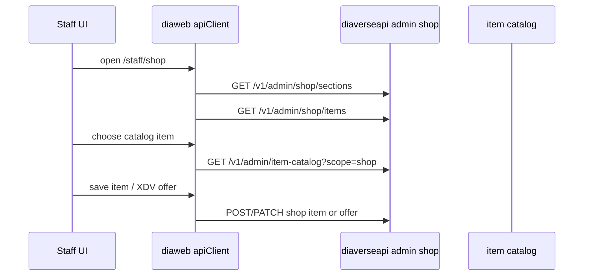
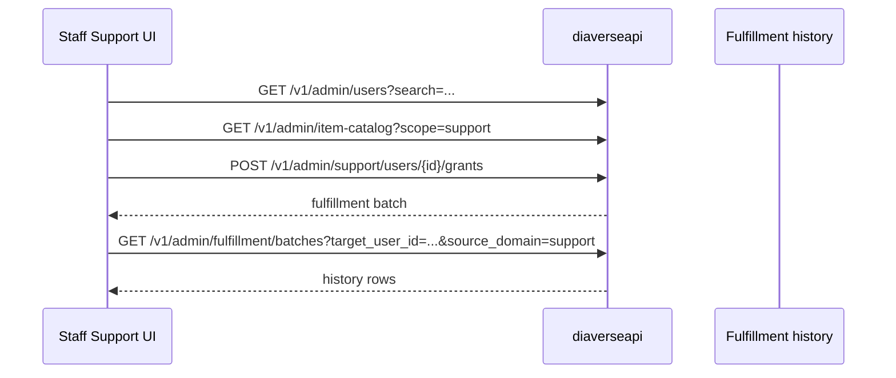

# Staff Commerce Admin

Документ описывает frontend staff-поверхности для магазина и саппорта. Текущий product decision: новый commerce/admin/support UI остается на русском языке без словарей до отдельного localization pass. Магазин не подключает real-money оплату; будущая валюта магазина - DCR.

## Модули

`modules/staff-shop` отвечает за staff-админку магазина:

- route: `/{lang}/staff/shop`
- API client: `modules/staff-shop/shop-admin-api.ts`
- типы: `modules/staff-shop/shop-admin-types.ts`
- UI: listing table, item editor, catalog picker, XDV offer editor, bulk add dialog

`modules/staff-support` отвечает за ручные выдачи:

- route: `/{lang}/staff/support`
- API client: `modules/staff-support/support-api.ts`
- типы: `modules/staff-support/support-types.ts`
- UI: user search, support catalog picker, grant lines, reason/ticket/idempotency, fulfillment history

`shared/auth/staffAccess.ts` мапит staff routes на module access rows. Для shop используется `shop`; для support используется `support`.

## Shop Admin Flow

Shop UI must show XDV offer controls only in this phase. Do not add Pay1Time, Prodamus, Zion, provider code, redirect URLs, payment return pages, or polling to shop UI until a separate DCR/real-payment decision is made.

When DCR arrives, add DCR-specific wallet UI and tests instead of reusing Advent provider controls.

## Support Grant Flow

Submit button requires:

- selected user
- at least one catalog line
- non-empty reason
- idempotency key with at least 8 chars
- `support:grant` or editable support module access

Backend feature flag `CABINET_SUPPORT_MANUAL_GRANTS_ENABLED` is default-disabled, so the UI can be deployed before enabling grants in production.

## Permissions

Navigation visibility uses `canViewStaffModule`. Mutating support controls use `canEditStaffModule` or explicit `support:grant` permission. Superadmin can use edit-capable modules even before an access row is loaded.

Relevant frontend tests:

- `__tests__/modules/staff-shop/*`
- `__tests__/modules/staff-support/*`
- `__tests__/modules/staff/StaffSidebar.test.tsx`
- `__tests__/shared/auth-permissions.test.ts`

## Logging

Frontend client logs are development-only:

- `[staff-shop]` DEBUG for fetch/filter state, INFO for mutations, WARN for API errors
- `[staff-support]` DEBUG for catalog/search state, INFO for submitted manual grants, WARN for validation/API failures

Do not log sensitive reward contents beyond target user ID and line count. Reasons and ticket IDs are backend audit metadata; frontend warnings should stay compact.

## Extension Checklist

To add a new staff commerce module:

1. Add backend staff module and seed permissions.
2. Add `StaffModuleKey`, route mapping, managed permission resource, and nav item.
3. Build API client with typed request/response contracts.
4. Keep UI operational and compact; avoid landing-page or marketing layouts.
5. Add route page under `app/[lang]/staff/...`.
6. Add tests for route mapping, nav visibility, permission gating, and primary mutation payload.
7. Keep Russian UI literals for this phase; do not add dictionaries until localization is scheduled.
